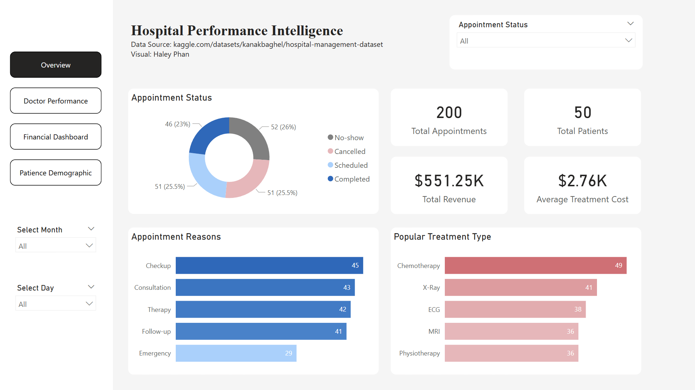

# ✨🏥 Healthcare Analytics Dashboard | Power BI Portfolio Project ✨

<p align="center">
  
  
  
</p>

<p align="center">
<b>Interactive hospital performance dashboard designed to transform healthcare data into actionable executive insights.</b>
</p>

---

## 🌟 Project Overview

This Power BI dashboard analyzes hospital operations, patient demographics, physician performance, and financial KPIs in one centralized reporting solution.

Designed to simulate how healthcare leadership teams monitor performance, improve efficiency, and support strategic decisions through data.

---

## 🎯 Business Objectives

✅ Monitor patient admissions & trends  
✅ Track financial performance & revenue KPIs  
✅ Analyze doctor productivity  
✅ Understand patient demographic patterns  
✅ Improve operational visibility for leadership  

---

# 📊 Dashboard Pages

## 🏥 Executive Overview



Provides a high-level summary of hospital performance, core KPIs, trends, and operational status.

---

## 💰 Financial Dashboard


Tracks revenue, cost drivers, profitability, and financial trends across departments.

---

## 👨‍⚕️ Doctor Performance


Measures physician productivity, patient volume, and comparative performance metrics.

---

## 👥 Patient Demographic


Breaks down patient populations by age, gender, and other key demographic indicators.

---

# 🛠️ Tools Used

| Tool | Purpose |
|------|---------|
| Power BI | Dashboard Development |
| Power Query | Data Cleaning |
| DAX | KPI Calculations |
| Excel / CSV | Source Data |
| Data Visualization | Reporting |

---

# 📌 Key Metrics Included

- Total Patients
- Admissions Growth %
- Revenue Trend
- Department Performance
- Doctor Productivity
- Demographic Segmentation
- Operational KPIs

---

# 💡 Business Value

Healthcare organizations need real-time visibility into both operations and finance.

This dashboard helps leaders:

✨ Improve resource allocation  
✨ Monitor physician effectiveness  
✨ Understand patient demand trends  
✨ Strengthen financial planning  
✨ Enable faster data-driven decisions  

---

# 📂 Repository Structure

```bash
powerbi-healthcare-dashboard/
│── hospital_dashboard.pbix
│── README.md
│── data/
│── screenshots/
    ├── Overview.png
    ├── Financial Dashboard.png
    ├── Doctor Performance.png
    ├── Patient Demographic.png
